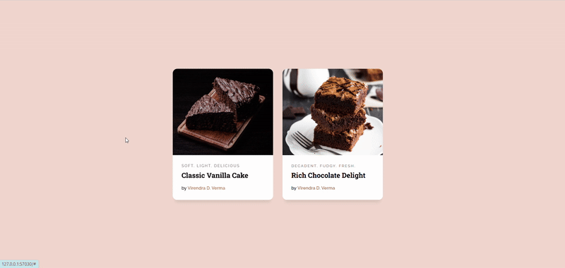
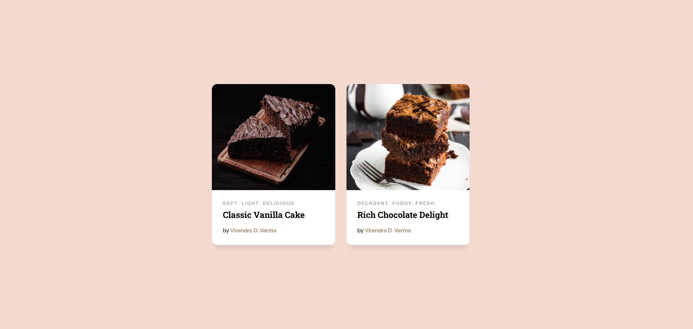
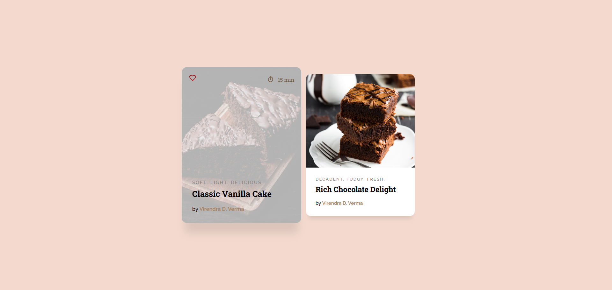
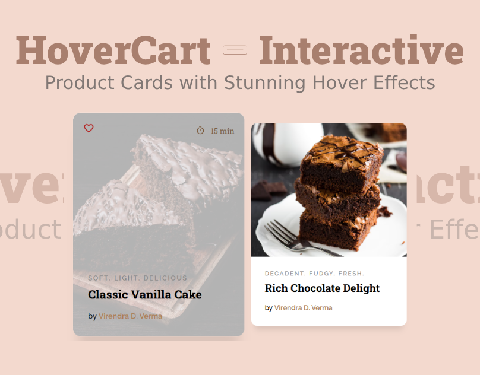

## HoverCart – Interactive Product Cards with Stunning Hover Effects

<a href="https://www.linkedin.com/in/dharmendraverma95/" target="_blank">🧑‍💻 LinkedIn Profile </a>

<a href="https://www.behance.net/dhirukumar" target="_blank">🧑‍💻 Behance Profile </a>

# 🍰 HoverCart

**HoverCart** is a sleek and lightweight UI component pack featuring animated product cards with interactive hover effects — perfect for e-commerce, bakery websites, portfolios, and creative landing pages.

---

## ✨ Features

- 🃏 Responsive Product Card Layouts  
- 🎞️ Smooth Hover Animations  
- 🎨 Easily Customizable Styles  
- ⚡ Lightweight & Fast Performance  
- 🍰 Baking-Themed Demo Cards (Vanilla, Chocolate, and more!)

---

## 📦 Tech Stack

- HTML5  
- CSS3 (with transitions)  

---

## 🚀 Live Demo

Check out the interactive demo here: 
 
👉 Desktop Design 

 
👉 Desktop UI UX Design 

 
📸 Desktop Design UI UX Layout 

 
📸 Desktop Design 

Cover 
